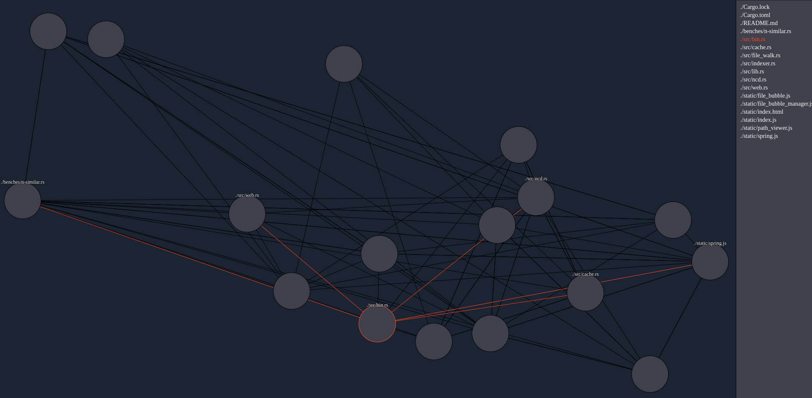

# Content Mapprs

I currently use Obsidian for writing notes. The main feature of Obsidian that I
really enjoy is the map feature. For those of you who don't use Obsidian, the
idea is that when you write a note, you can link that note to other notes. This
is a manual procedure where you have to physically type the connection you
want. This is super useful and allows for a lot of advantages like being able
to write about a topic, then link it to a broader topic eg
maths/physics/programming etc. My only issue with this is that I am lazy and
often forget to create the connection.

This project is a proof of concept, using ideas stolen (ahem **borrowed**) from
Tsoding's stream which you can watch here: [Zip works Better than
AI](https://youtu.be/9n39SbRPXKQ?si=sXDPGGMMoFYBxRym). Tsoding's code can be
found [here](https://github.com/tsoding/data-mining-in-c). Tsoding references
the paper [Less is More: Parameter-Free Text Classification with
Gzip](https://arxiv.org/abs/2212.09410) where the original theory was devised.

During Tsoding's stream (and within the paper) the main idea is that we use
Gzip to classify documents into certain categories. This was used for example
with news articles to determine if the content of those articles contained
science content or political content etc.

Where this project differs is that I have used the same methodology to compute
the similarity in files within a directory recursively. So instead of
classifying documents, we are instead trying to find all of the documents that
are the most similar. With the main motivation being that it will hopefully
create connections between files that have a link, in the same way Obsidian
does, except without having to manually create the link.

This is all built into a CLI, which can either simply print the results to
terminal by running:

```bash
./content_mapp_rs print
```

To print the nearest 3 files (default is 5) use:

```bash
./content_mapp_rs -n 3 print
```

To specify the directory you can use:

```bash
./content_mapp_rs --dir [YOUR DIR] print
```

This CLI can also host a server which runs locally and opens a web GUI to
interact with all of the connections. This can be done using

```bash
./content_mapp_rs serve
```

This should by default open your browser at localhost:3000 however if it fails
to open the browser you can just go to localhost:3000 manually. The server will
watch for file changes and recompute the similarities of all the files whenever
a file changes. A screenshot of what this looks like can be found below:


This CLI will create a file in the directory you run it in called
.content_mapp_rs. This file is a cache used to speed up computation and will
basically just allow the CLI to only run on files that have changed as well as
minimize how often we need to run Gzip which is the slowest operation. This
file can safely be deleted and the CLI will recreate it from scratch next time
you run it.

Note that this project was for fun. This is not "Production" code. I give no
warranty and will probably not maintain it further. This was a weekend project
that I hope you all enjoy
